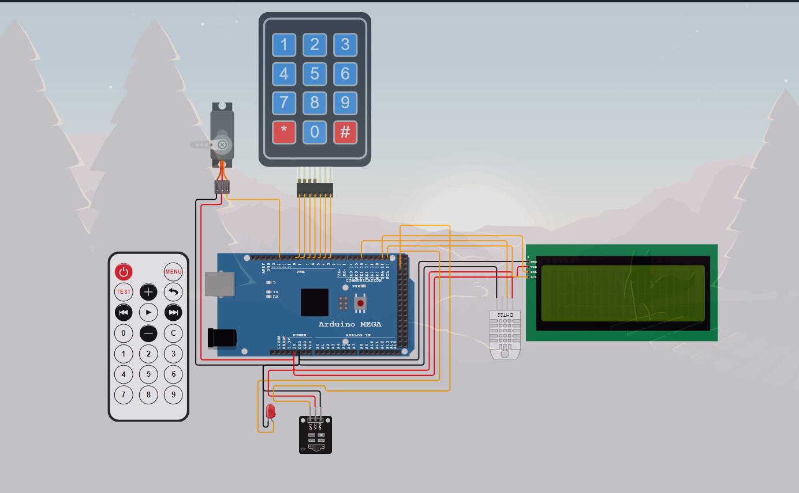

# 🚀 Dự Án Smart Home IOT: Lab 1 Môn Học Thiết Kế Hệ Thống Nhúng

**Tác giả:** Nguyễn Thế Anh - `Horob1`

**Mã sv** CT060202 - `L01`

**Công cụ biên tập:** Wokwi, Platform IO IDE, VsCode

Dự án nhà thông minh IOT này sử dụng vi điều khiển Arduino Mega 2560 để điều khiển và kết nối nhiều linh kiện bao gồm bàn phím ma trận, cảm biến nhiệt độ/độ ẩm DHT22, màn hình LCD 2004, động cơ servo, bộ nhận tín hiệu IR và đèn LED. Dưới đây là hướng dẫn chi tiết về các linh kiện và cách đấu nối.

---

## 🌏 1. Tổng quan hệ thống

### 1.1. Mục tiêu

Xây dựng hệ thống smart home đơn giản với các chức năng:

- Khóa cửa thông minh sử dụng bàn phím và qua hồng ngoại
- Điều khiển thiết bị điện từ xa qua hồng ngoại
- Giám sát và hiển thị thông số môi trường (nhiệt độ, độ ẩm)

### 1.2 📜 Danh Sách Linh Kiện & Kết Nối

#### 1.2.1. 🧠 Arduino Mega 2560

- **Chức năng:** Vi điều khiển chính của hệ thống.

#### 1.2.2. ⌨️ Bàn Phím Membrane 3x4

- **Loại:** Bàn phím ma trận 3x4
- **Kết nối:**
  - `R1` ➔ Chân 9
  - `R2` ➔ Chân 8
  - `R3` ➔ Chân 7
  - `R4` ➔ Chân 6
  - `C1` ➔ Chân 5
  - `C2` ➔ Chân 4
  - `C3` ➔ Chân 3
  - `C4` ➔ Chân 2

#### 1.2.3. 🌡️ Cảm Biến Nhiệt Độ & Độ Ẩm DHT22

- **Kết nối:**
  - `SDA` ➔ Chân 16
  - `GND` ➔ GND
  - `VCC` ➔ 5V

#### 1.2.4. 🖥️ Màn Hình LCD 2004 (I2C)

- **Loại kết nối:** I2C
- **Kết nối:**
  - `GND` ➔ GND
  - `VCC` ➔ 5V
  - `SDA` ➔ Chân 20
  - `SCL` ➔ Chân 21

#### 1.2.5. ⚙️ Động Cơ Servo

- **Kết nối:**
  - `PWM` ➔ Chân 12
  - `GND` ➔ GND
  - `V+` ➔ 5V

#### 1.2.6. 📡 Bộ Nhận Tín Hiệu IR

- **Kết nối:**
  - `GND` ➔ GND
  - `VCC` ➔ 5V
  - `DAT` ➔ Chân 24

#### 1.2.7. 🎛️ Điều Khiển Từ Xa IR

- **Chức năng:** Điều khiển hệ thống thông qua bộ nhận IR.

#### 1.2.8. 💡 Đèn LED Đỏ

- **Kết nối:**
  - `A` ➔ Chân 22 (Cực dương)
  - `C` ➔ GND (Cực âm)

### 1.3 🔧 Hướng Dẫn Lắp Ráp

1. **Kết nối Bàn Phím** vào các chân kỹ thuật số của Arduino Mega theo sơ đồ trên.
2. **Nối Cảm Biến DHT22**, kết nối `SDA` vào chân 16 và cấp nguồn cho cảm biến (`VCC` đến 5V và `GND` đến GND).
3. **Kết nối Màn Hình LCD 2004** sử dụng giao thức I2C, nối `SDA` vào chân 20 và `SCL` vào chân 21.
4. **Gắn Động Cơ Servo**, kết nối `PWM` vào chân 12 và cấp nguồn từ chân 5V và GND.
5. **Lắp Bộ Nhận IR**, kết nối `DAT` vào chân 24, `VCC` vào 5V, và `GND` vào GND.
6. **Kết nối Đèn LED Đỏ** vào bo mạch, nối cực anode (`A`) vào chân 22 và cực cathode (`C`) vào GND.

---

## 📈 2. Sơ đồ

## 3. 🛡️ Các công cụ hỗ trợ và thư viện sử dụng
### 3.1 📦 Các thư viện sử dụng
-	marcoschwartz/LiquidCrystal_I2C@^1.1.4
-	arduino-libraries/Servo@^1.2.2
-	adafruit/DHT sensor library@^1.4.6
-	chris--a/Keypad@^3.1.1
-	z3t0/IRremote@^4.4.1
- SafeState @1.0.0 - thư viện tự viết
### 3.2 🔧 Các công cụ nhỗ trợ
- 🐶 Wokwi Công cụ mô phỏng thiết bị 
- 📃 Vscode text editor
- 🐝 Platform IO 
## 💡 4. Các chức năng chính

### 4.1 🔑 Mở cửa
- Khi của đóng nguòi dùng sẽ nhập một phím bất kỳ trên keyboard để lcd hiển thị ô nhập mã. Nhập mã gồm 4 ký tự lên keyboard để mở cửa, nếu nhập đúng sẽ hiển thị thông báo chào mừng và cửa mở (servo sẽ mở lên). Nếu mở sai sẽ báo lỗi!
- Có thể dùng remote để mở cửa. Nhấn nút on trên remote để vào chế độ mở cửa bằng remote. Nhập mã gồm 4 ký tự bằng cách bấm nút trên remote để mở cửa, nếu nhập đúng sẽ hiển thị thông báo chào mừng và cửa mở (servo sẽ mở lên). Nếu mở sai sẽ báo lỗi!

### 4.2 🔐 Đổi pass
- Khi của mở nguòi dùng nhấn phím * trên keyboard để vào chế độ đổi mật khẩu. Trước hệt phải nhập đúng mật khẩu cũ sau đó yêu cầu nhập 2 lần, nhập trùng khớp sẽ đổi mật khẩu nếu không thì sẽ thông báo lỗi.

### 4.3 🖲️ Đóng cửa
- Nhấn # để đóng cửa hoặc nhấn nút on/off trên remote để đóng cửa

### 4.4 🌡️ Cảm biến nhiệt độ và độ ẩm
- Đo nhiệt độ và độ ẩm để hiển thị, có thể nhấn nút play/stop trên remote để tắt chức năng này

### 4.5 💡Bật đèn
- Nhấn nút C trên remote để bật tắt đèn

## 📊 5.  Kết luận và đánh giá

### 5.1. ✅ Ưu điểm

- Dễ dàng mở rộng và nâng cấp
- Giao diện người dùng thân thiện

### 5.2. 🛑 Hạn chế

- Chưa có kết nối internet
- Phụ thuộc nguồn điện
- Chưa có backup dữ liệu

### 5.3 🚀 Đề xuất phát triển

- Thêm pin dự phòng
- Phát triển ứng dụng mobile điều khiển
- Thêm các cảm biến an ninh
